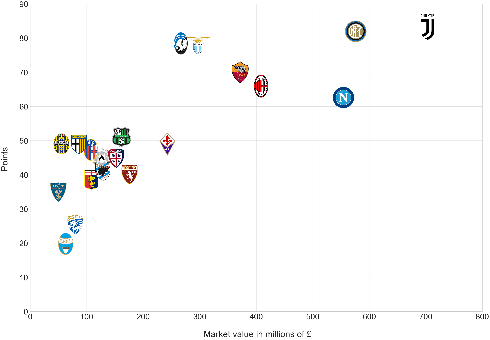
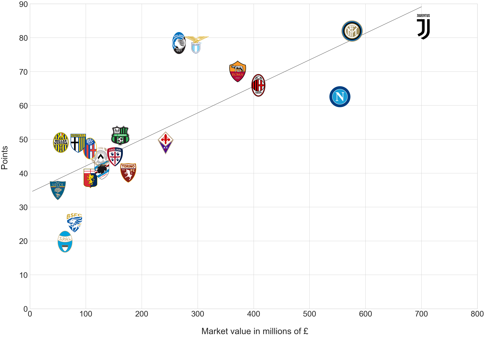

# Serie A 2019/20
Graph of each team's matket value compared to the amount of points they earned in the 2019/20 Seria A season.
Y axis shows the points each team has earned, whiel X axis represents each teams market value.
Market value was averaged from 3 numbers - start, middle and end fo season prices.  Data from:
- [Whoscored.com](https://www.whoscored.com/Regions/108/Tournaments/5/Seasons/7928/Stages/17835/TeamStatistics/Italy-Serie-A-2019-2020)
- [Transfermarkt](https://www.transfermarkt.co.uk/serie-a/marktwerteverein/wettbewerb/IT1/plus/?stichtag=2020-09-01)
- [Footballcritic](https://www.footballcritic.com/serie-a/season-2019-2020/8/22436)

